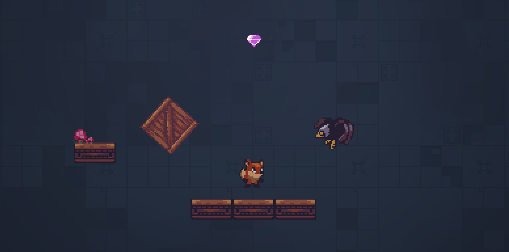
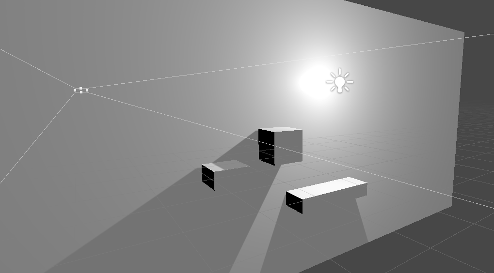
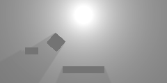
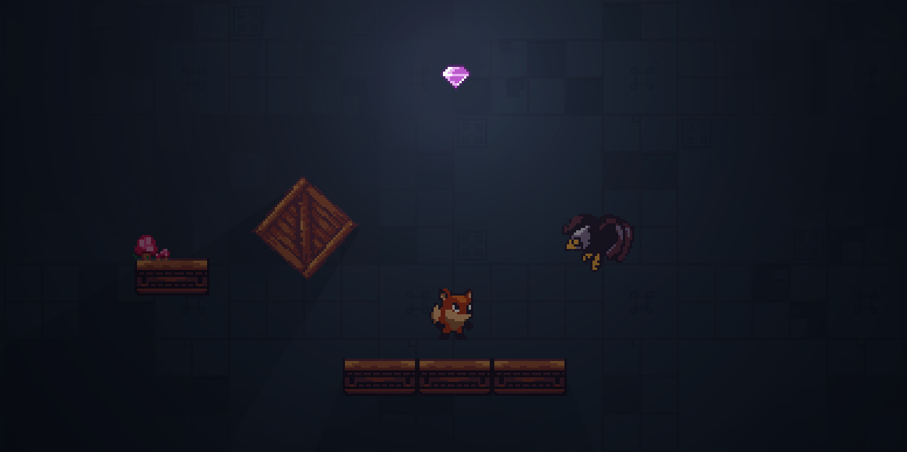

<!--
*** Based on the Best-README-Template: https://github.com/othneildrew/Best-README-Template
***
*** To avoid retyping too much info. Do a search and replace for the following:
*** repo_name, project_title, project_description
-->

<!-- PROJECT SHIELDS -->
<!-- [![Release][release-shield]][release-url] -->
<!-- [![Last Commit][last-commit-shield]][last-commit-url] -->
<!-- [![Contributors][contributors-shield]][contributors-url] -->
<!-- [![Forks][forks-shield]][forks-url] -->
<!-- [![Stargazers][stars-shield]][stars-url] -->
<!-- [![Issues][issues-shield]][issues-url] -->
<!-- [![MIT License][license-shield]][license-url] -->
<!-- [![LinkedIn][linkedin-shield]][linkedin-url] -->

<!-- PROJECT LOGO -->
 

<!--    -->

  <h2 align="center">Pixel Perfect Lighting</h2>

  

    Implements several post-processing effects in Unity for 2D pixel perfect rendering with lighting and dynamic shadows.
     
<!--     <a href="https://github.com/Tim-W-James/Pixel-Perfect-Lighting"><strong>Explore the docs »</strong></a>
      
      -->
<!--     <a href="https://github.com/Tim-W-James/Pixel-Perfect-Lighting">View Demo</a> -->
<!--     ·
    <a href="https://github.com/Tim-W-James/Pixel-Perfect-Lighting/issues">Report Bug</a> -->
<!--     ·
    <a href="https://github.com/Tim-W-James/Pixel-Perfect-Lighting/issues">Request Feature</a> -->
  

<!-- TABLE OF CONTENTS -->

  
Table of Contents

  <ol>
    <li>
      <a href="#about-the-project">About The Project</a>
      <ul>
        <li><a href="#features">Features</a></li>
        <li><a href="#built-with">Built With</a></li>
      </ul>
    </li>
    <li>
      <a href="#usage">Usage</a>
      <ul>
        <li><a href="#2d-pixel-perfect-rendering">2D Pixel Perfect Rendering</a></li>
        <li><a href="#2d-shadows">2D Shadows</a></li>
<!--         <li><a href="#example-usecases">Example Usecases</a></li> -->
      </ul>
    </li>
<!--     <li><a href="#roadmap">Roadmap</a></li> -->
<!--     <li><a href="#contributing">Contributing</a></li> -->
<!--    <li><a href="#license">License</a></li> -->
    <li><a href="#contact">Contact</a></li>
<!--     <li><a href="#acknowledgements">Acknowledgements</a></li> -->
  </ol>

<!-- ABOUT THE PROJECT -->
## About The Project
[![Product Name Screen Shot][product-screenshot]](https://github.com/Tim-W-James/Pixel-Perfect-Lighting)
Combines the Unity [2D Pixel Perfect Camera](https://docs.unity3d.com/Packages/com.unity.2d.pixel-perfect@1.0/manual/index.html) with [this 2D shadows technique](https://medium.com/@tidyui/fast-beautiful-2d-lighting-in-unity-47b76b10447c) and other [post processing effects](https://docs.google.com/document/d/1brkjiMgB8urmjMZFrbpasWn8Yp-qtIZmtJwBFIAfaxo/view?usp=sharing#heading=h.5v5whdw1py9q).

### Features

* 2D Pixel Perfect Rendering
* Sprite lighting
* Dynamic shadows
* Post-processing effects such as bloom

### Built With

* [Unity3D 2018.4.14f1](https://unity.com/)
* C#
* Visual Studio Code

<!-- USAGE -->
## Usage

Clone the repo and use with Unity 2018.4.14f1. Repo contains a demo scene to showcase the rendering. 

### 2D Pixel Perfect Rendering
The main camera has a [2D Pixel Perfect Camera](https://docs.unity3d.com/Packages/com.unity.2d.pixel-perfect@1.0/manual/index.html) component. Adjust pixels per unit and reference resolution to match those of your pixel art.

### 2D Shadows
**Note**: this method of drawing shadows is no longer necessary for Unity 2019 and beyond. See Unity [documentation](https://docs.unity3d.com/Packages/com.unity.render-pipelines.universal@7.1/manual/2DShadows.html) for more details.

I have used [this](https://medium.com/@tidyui/fast-beautiful-2d-lighting-in-unity-47b76b10447c) method which implements [this](https://github.com/prime31/SpriteLightKit) script to blend cameras together.

Since we can’t render shadows in 2D, we need to create a copy of our scene with anything we want to cast shadows having 3D geometry. These objects are then given the 'Shadowcaster' layer. Using Unity 3D primitives such as cubes is the easiest way to approximate simple shadows, and these objects can be attached as children of their respective sprites. Use greater Z scales for geometry or adjust the Z position of lights to adjust the ‘height’ of lights/objects.

_Example Scene without Shadows_:
 

_Geometry of Scene_:
 

**Note**: the fox and eagle are not currently drawing shadows.

This is achieved with the use of two cameras. Our main camera renders all sprites and UI as usual, however our second camera, the 'ShadowCamera', only renders shadows.

_Main camera_:
 

_Shadow Camera_:
 

Then these cameras are blended together to give the effect of shadows:
 

Belding is done by outputting the shadow camera to a texture, and then blending this texture with the main camera. This also allows sprites to be partially shadowed.

The shadow camera is not pixel perfect. We cannot both upscale render textures and output the camera to a texture because this is not supported by the package. Instead, we use soft shadows, which is what most other pixel art games do. The difference between pixel perfect shadows and soft shadows is very subtle and only really visible during motion. A blend of pixel art and high resolution effects can look pleasing regardless. Additional post processing effects can be applied with the 

Further details can be found [here](https://docs.google.com/document/d/1brkjiMgB8urmjMZFrbpasWn8Yp-qtIZmtJwBFIAfaxo/view?usp=sharing#heading=h.91d5o2vw6ai4).

<!-- CONTACT -->
## Contact

Email: [tim.jameswork9800@gmail.com](mailto:tim.jameswork9800@gmail.com "tim.jameswork9800@gmail.com")

Project Link: [https://github.com/Tim-W-James/Pixel-Perfect-Lighting](https://github.com/Tim-W-James/Pixel-Perfect-Lighting)

<!-- MARKDOWN LINKS & IMAGES -->
<!-- https://www.markdownguide.org/basic-syntax/#reference-style-links -->
[release-shield]: https://img.shields.io/github/v/release/Tim-W-James/Pixel-Perfect-Lighting.svg?include_prereleases&style=for-the-badge
[release-url]: https://github.com/Tim-W-James/Pixel-Perfect-Lighting/releases
[last-commit-shield]: https://img.shields.io/github/last-commit/Tim-W-James/Pixel-Perfect-Lighting.svg?style=for-the-badge
[last-commit-url]: https://github.com/Tim-W-James/Pixel-Perfect-Lighting/commits/main
[contributors-shield]: https://img.shields.io/github/contributors/Tim-W-James/Pixel-Perfect-Lighting.svg?style=for-the-badge
[contributors-url]: https://github.com/Tim-W-James/Pixel-Perfect-Lighting/graphs/contributors
[contributors-shield]: https://img.shields.io/github/contributors/Tim-W-James/Pixel-Perfect-Lighting.svg?style=for-the-badge
[contributors-url]: https://github.com/Tim-W-James/Pixel-Perfect-Lighting/graphs/contributors
[forks-shield]: https://img.shields.io/github/forks/Tim-W-James/Pixel-Perfect-Lighting.svg?style=for-the-badge
[forks-url]: https://github.com/Tim-W-James/Pixel-Perfect-Lighting/network/members
[stars-shield]: https://img.shields.io/github/stars/Tim-W-James/Pixel-Perfect-Lighting.svg?style=for-the-badge
[stars-url]: https://github.com/Tim-W-James/repPixel-Perfect-Lightingo_name/stargazers
[issues-shield]: https://img.shields.io/github/issues/Tim-W-James/Pixel-Perfect-Lighting.svg?style=for-the-badge
[issues-url]: https://github.com/Tim-W-James/Pixel-Perfect-Lighting/issues
[license-shield]: https://img.shields.io/github/license/Tim-W-James/Pixel-Perfect-Lighting?style=for-the-badge
[license-url]: https://github.com/Tim-W-James/Pixel-Perfect-Lighting/blob/main/LICENSE.txt
[linkedin-shield]: https://img.shields.io/badge/-LinkedIn-black.svg?style=for-the-badge&logo=linkedin&colorB=555
[linkedin-url]: https://linkedin.com/in/timothy-william-james/
[product-screenshot]: images/screenshot.png

<!-- USEFUL LINKS FOR MARKDOWN
* https://www.markdownguide.org/basic-syntax
* https://www.webpagefx.com/tools/emoji-cheat-sheet
* https://shields.io
* https://choosealicense.com
* https://pages.github.com
* https://daneden.github.io/animate.css
* https://connoratherton.com/loaders
* https://kenwheeler.github.io/slick
* https://github.com/cferdinandi/smooth-scroll
* http://leafo.net/sticky-kit
* http://jvectormap.com
* https://fontawesome.com -->
